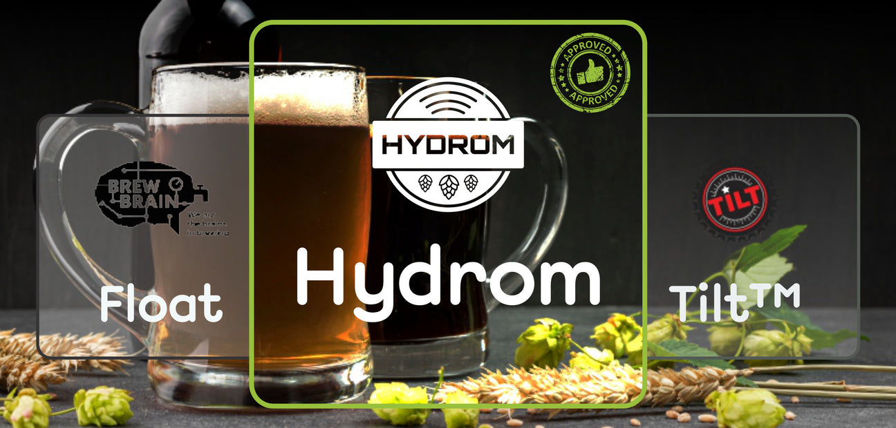

This product is designed, programmed, assembled and tested in Germany. 
Read here why the Hydrom is ahead of the competition.

<!--truncate-->

With the recent evolution of technology, the process of brewing has become much easy and more convenient. Intelligent and very smart sensors can be the difference between a good brew and a great one. A brewmaster always has priorities over a consistent and good-quality hydrometer, but choosing the correct device can be overwhelming.

“Brewing is an art, and all those who take an active interest in it can be regarded as artists.” Like all artists would go for the best sound system, below are the top brewing tools you can find on the market.

HYDROM

Hydrom is the BEST tool with unmatched features that every homebrewer would need to have accurate data. It's a fantastic digital brewing tool that measures accurately and functions perfectly. If you’re looking for that perfect and complete 21st technology brewing tool to get the most excellent hand-crafted beers with the perfect flavor and composition, then Hydrom is for you. Hydrom is fully assembled and doesn’t need cloud storage, but measures the SG value of your beer during fermentation and transmits the data through WiFi or Bluetooth.

It flawlessly combines the advantages of all free-floating hydrometers you can find in the market and is capable of taking your brewing game to the next level.

Its significance is much larger. It combines amazing features and performance with a design that should have it competing with and beating all other brewing tools on just about everything and the price.

Main features:

Full Calibration Wizard
Bluetooth available
WLAN (access point mode, Client Mode)
Open interfaces (MQTT, TCP, http)
Soldered and programmed product
Various cloud services are supported (without extra hardware)
Firmware update via web interface possible
Pros:

Measures Density, Temperature, and Rate of Fermentation in real-time
Bluetooth available (completely compatible with the Tilt Hydrometer)
Does not need the internet
Custom MQTT, HTTP, TCP, and Messages are available
It has a clean and very intuitive user interface
Most affordable hydrometer in the market
Comes with a USBC charging socket which is is the latest tech and standard, supported by almost all laptops, mobile phones, and other manufacturer devices
Cons:

The diameter of 50mm may be too large for some fermenters.
Cannot be shipped to the USA for patent reasons.
Not suitable for high pressures. (>1bar/100 kPa)
FLOAT

Float is a nice and affordable food-grade housing brewing tool to measure your fermentation activity, temperature, and SG value. It’s quite easy to use and very portable.

One great feature is that it doesn’t need to be stored in a storage solution. Simply a few drops of distilled water in the storage cap is all it needs to stay protected.

Main features:

Own logging platform
WLAN (client mode)
Chargeable Battery (micro USB)
Pros:

Float easily connects to your WiFi network and stores all SG and temperature data in your free My Brewbrain account.
Chargeable Battery (micro USB)
Fairly cheap
Cons:

The usability of the device depends on the business plan.
If the servers are switched off, the device is dead
Without the internet it is useless
Inflexible with only one interface (WLAN with Internet)
The data is collected centrally on the manufacturer's site.
No backups possible.
No simple switch to another platform
New platforms cannot be added individually.
Due to a lack of standards, there is no possibility to connect a service that is not yet supported.
Outdated charging standard (almost 15 years old standard)
TILT™

Unlike the two previous hydrometers, the hydrometer has a cylinder of its own production as a housing.
Also, the Tilt™ itself is just an extension of a smartphone/tablet.
So it does not have its own WiFi connection and thus cannot talk directly to the Cloudbackens.
The next big difference is that the Tilt™ does not rely on rechargeable batteries but uses disposable batteries.
Main features:

Compatible with any iOS/Android smartphone/tablet or Tilt Pi.
Own Case
Only Bluetooth available
Different colors for monitoring multiple batches
Disposable battery without charging possibility.
Pros:

* Bluetooth available
With the availability of a Bluetooth connectivity feature, the brewing process can be monitored anywhere within the Bluetooth range.
* Simple transmission concept of the data (iBeacon)
If Baron Brew Equipment LLC discontinues the product, it does not become useless for the customer
* Own Case
Cons:

* Most expensive free Floating Hydrometer on market
* Only Bluetooth available
* Low range
* In order to send the data to the Internet or Local Lan, an extra device must be purchased.
* A maximum of 8 Devices can be used in parallel

