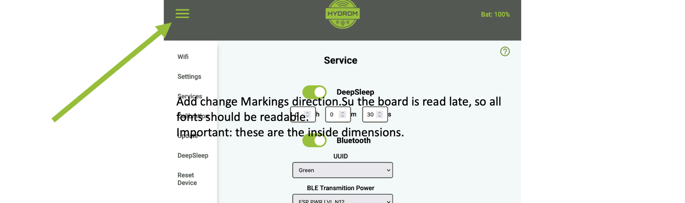
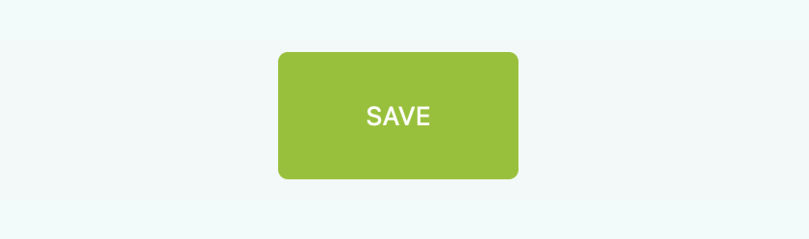
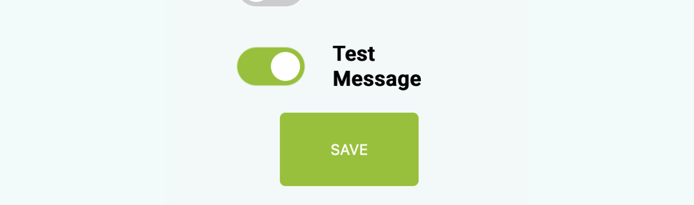
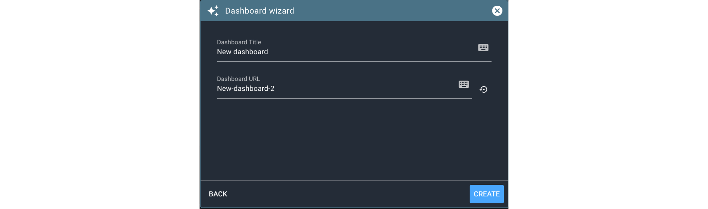
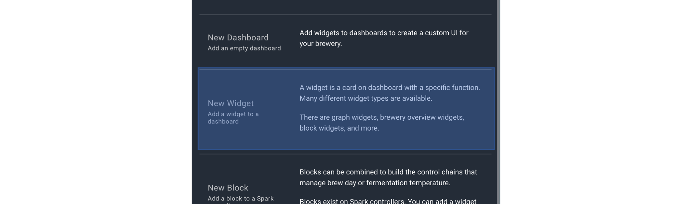
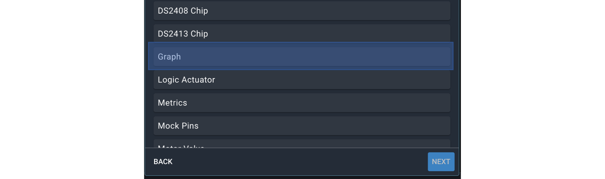
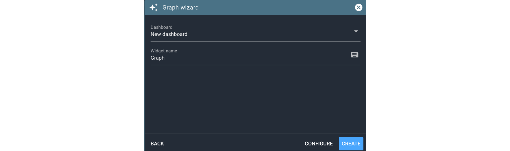
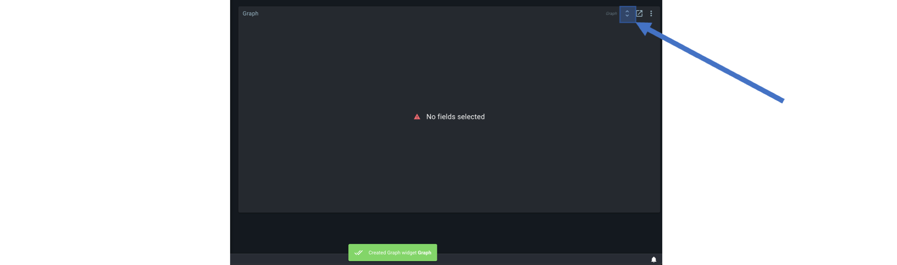
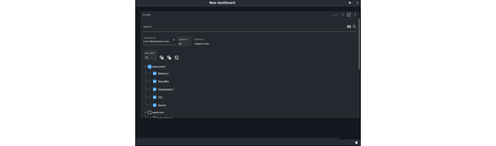
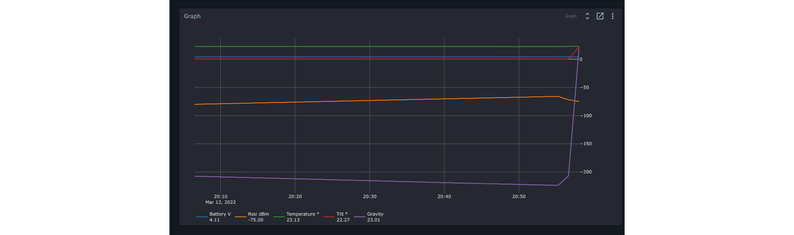

# Connect the Hydrom to Brewblox

## Precondition

:::tip
To make this setting you must have access to the user interface. If this is not the case, see here how to do it:[access-to-the-user-interface.md](../docs/Getting%20Started/establish-first-connection-to-the-hydrom/access-to-the-user-interface.mdx "mention")

In order to connect the Hydrom to Brewblox, a Brewblox server must first be set up.

[https://brewblox.netlify.app/user/startup.html#what-you-will-need](https://brewblox.netlify.app/user/startup.html#what-you-will-need)  
A Pi with Brewblox was set up
:::

## Adding Hydrom to BrewBlox

The Hydrom is natively supported by Brewblox. This means that once the hydrom is set up, the readings are automatically sent to the server and can be used. Multiple devices can also be used in parallel by customising the name of the Hydrom.

There are two basic ways to connect the Hydrom to Brewblox.

1. via WLAN  
   Assuming the Hydrom is on the same network as the Brewblox server, it is best to set it up via WLAN. How to do this is described in this manual.
2. via Bluetooth  
   If the Brewblox server is not in the WLAN and there is no access to a WLAN, the Hydrom can only be connected via Bluetooth. No instructions have yet been written for this. In principle, you can say, follow the instructions for the Tilt Hydrometer: [https://www.brewblox.com/user/services/tilt.html](https://www.brewblox.com/user/services/tilt.html)  
   These instructions also apply 1:1 to the Hydrom.

## Configuring the Hydrom

## Step 1: Open the Menue

To access the menu bar you have to click on the three lines in the upper left corner. (See arrow)  
Then the menu bar will open.

## Step 2: Select "Service" 

### Step 3: Activate Brewblox

**Server Address:** Name or IP of the Brewblox/MQTT broker

**Server Port:** MQTT port, which is 1883 by default.

**Path / URI:** must be set to "brewcast/history", which is the MQTT-Topic for the history service.

**Username / Password:** This field remains empty because Brewblox does not yet support MQTT with authentication.

The two indicators next to the IP address of the server and the port of the server then turn green/red when a test message has been sent  
The Hydrom then checks whether the address can be reached and if so, whether the destination port is open.

### additional settings

:::info
In order not to consume too much power, we would turn Bluetooth off when it is not needed. It was documented here:  
[add-bluetooth.md](../add-bluetooth.md)
:::

:::info
### activate DeepSleep

Activating DeepSleep is mandatory for the hydrom to be able to send data. If DeepSleep is activated, the hydrom wakes up after the set time and sends the data to the set service. Afterwards, the hydrom goes back to sleep and waits for the new service.
[enable-deepsleep.md](../other-settings/enable-deepsleep.md)
:::

:::info
### Save Settings

Saving the data is important because it is the only way to connect to the service after waking up from DeepSleep.

You can check whether the saving was successful by looking at the settings file at http://hydrom001/settings.json/. to check if the save was successful. This file is the permanent memory of the Hydrom.

A second way to check the saving is to reload the page (all modern browsers offer this Feature). If the properties are then reloaded, the hydrom has accepted them, otherwise the old settings are reloaded.

:::

:::info
### Send Test-message

By activating this button, you can check whether the Hydrom has a connection to the service and to the individual parts of the service. If you now click on "Save", the set services are executed once and the page is reloaded. On the new page you can see whether the servers are accessible and the ports are open.

:::

:::info
### Put Hydrom to DeepSleep

To ensure that the device sends measured values to the Service in the set interval as intended, the Hydrom must be put into deep sleep.

There are two ways to put the Hydrom into deep sleep.
Turning the ***power switch off and on***  is the easiest way to put the Hydrom into deep sleep.
The alternative way is to put it to sleep ***via the UI***.
To do this, open the navigation bar and go to the "DeepSleep" tab.
:::

## Configuration of the Hydrom in the Brewblox

### Add a dashboard

In order to view the measured values of the Hydrom, a dashboard must first be created if one does not already exist.

### Add widget

The measured values of the Hydrom can be visualised via a graph. To do this, a widget must first be created.

### Add graph

Now add a graph to this widget

Click on "Create" to create this widget.

### Activating the Hydrom

Adding the graph is not enough to display the measured values of the Hydrom. The measured values of the Hydrom do not have to be made visible. To do this, go to the top right corner and click on the two triangles to activate the settings of the graph.

In the settings of the graph, the filter has to be activated. So practically, which measured values do I want to see. For clarity, it is recommended to activate only the required measured values here.

At the end you see at least the test measurement after which the hydrom was put to sleep but also the measured values in the set interval.

