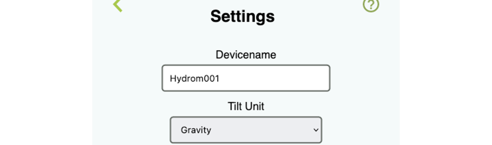

# Changing the Hydrom name


ATTENTION! If you have entered incorrect Name for the Hydrom, you will not be able to connect to the Hydrom via existing Network. You will then need to use the Configuration-Wifi.

If the setting is incorrect, you can reset the Hydrom as described here:

[#reset-by-the-button](factory-reset.md#reset-by-the-button "mention")
:::


Changing the Hydrom name has the following effect:

1. The user interface is not accessed via [http://hydrom001/](http://hydrom001) as described in the chapter[#connect-to-the-hydrom-via-browser](../docs/Getting%20Started/establish-first-connection-to-the-hydrom/access-to-the-user-interface.mdx#connect-to-the-hydrom-via-browser "mention"), but now via http://\<own\_choosen\_name>/.
2.  Some of the services described in the chapter [Broken link](broken-reference "mention")now send to a different address.

    However, this is mentioned separately in the respective instruction article.
:::

:::tip
To make this setting you must have access to the user interface. If this is not the case, see here how to do it:

[access-to-the-user-interface.md](../docs/Getting%20Started/establish-first-connection-to-the-hydrom/access-to-the-user-interface.mdx "mention")
:::

## Step 1: Open the Menue

To access the menu bar you have to click on the three lines in the upper left corner. (See arrow)\
Then the menu bar will open.

## Step 2: Select "Settings"

## Step 3: Change device name

To change the device name, enter the new name under the "Devicename" lettering  
By default, the device name is "Hydrom001".

### Save Settings

Saving the data is important because it is the only way to connect to the service after waking up from DeepSleep.

You can check whether the saving was successful by looking at the settings file at http://hydrom001/settings.json/. to check if the save was successful. This file is the permanent memory of the Hydrom.

A second way to check the saving is to reload the page (all browsers offer this). If the properties are then reloaded, the hydrom has accepted them, otherwise the old settings are reloaded.
